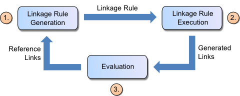

# Linking

The Workbench guides the user through the process of creating linking tasks for interlinking two data sources.
It provides the following components:

-  **Workspace Browser:** Enables the user to browse the projects in the workspace. Linking Tasks can be loaded from a project and comitted back to it later.
-  **Linkage Rule Editor:** A graphical editor which enables the user to easily create and edit linkage rules. The widget will show the current link specification in a tree view while allowing editing using drag-and-drop.
-  **Evaluation:** Allows the user to execute the current linkage rule. The links are displayed while they are generated on-the-fly. Generated links for which the reference link set does not specify their correctness, the user may confirm or decline their correctness. The user may request detailed summaries on how the similarity score of specific links is composed of.

The typical workflow of creating a new linking task consists of:

1. Before executing the actual matching, a linkage rule needs to be built, which specifies how two entities are compared for equivalence. Linkage Rules can be created by a human expert based on the data sources that are to be matched.
2. The linkage rule is executed, resulting in a set of links.
3. The purpose of the evaluation step is to measure the success of the entity matching task and to find potential errors in the generated links. The success of the entity matching task can be determined by comparing the generated links with a gold standard consisting of a set of reference links. A set of reference links consists of positive reference links that identify pairs of entities that are known to match and negative reference links that identify pairs that that are known non-matches. If no reference links are known, a gold standard can be generated by a human expert who confirms or rejects a number of links.

## Linkage Rule Editor

The Linkage Rule Editor allows users to edit linkage rules in graphical way. Linkage rules are created as an operator tree by dragging and dropping the rule elements.

The editor is divided in two parts:
The left pane contains the most frequent used \[\[Inputs|property paths\]\] for the given data sets and restrictions. It also contains a list of all available operators (\[\[transformation|transformations\]\], \[\[comparison|comparators\]\] and \[\[aggregation|aggregators\]\]) as draggable elements.
The right part (editor pane) allows for drawing the flow chart by combining the elements chosen.

\[\[image:silk\_editor.png\]\]

### Editing

-   Drag elements from the left pane to the editor pane.
-   Connect the elements by drawing connections from and to the element endpoints (dots to the left and right of the element box).
-   Build a flow chart by connecting the elements, ending in one single element (either a comparison or aggregation).

The editor will guide the user in building the flow chart by highlighting connectable elements when drawing a new connection line.

### Property Paths

Property paths for the two data sources to be interlinked are loaded on the left pane and added in the order of their frequency in the data source.
Users can also add custom paths by dragging the `(custom path)` element to the editor pane and \[\[Inputs|editing the path\]\].

### Operators

The following operator panes are shown below the property paths:

-  Transformations
-  Comparisons
-  Aggregations

Hovering over the operator elements will show you more information on them.

### Threshold

`Threshold` defines the maximum distance between two data items which is required to generate a link between them.

### Link Limit

`Link Limit` defines the number of links originating from a single data item. Please choose between 1 and n (unlimited).

## Reference Links

Reference Links (in record linkage usually called Golden Set) are a set of links whose correctness has either been confirmed or declined by the user. Reference links can be used to evaluate the completeness and correctness of a linkage rule.

We distinguish between positive and negative reference links:

- Positive reference links represent definitive matches
- Negative reference links represent definitive non-matches.
