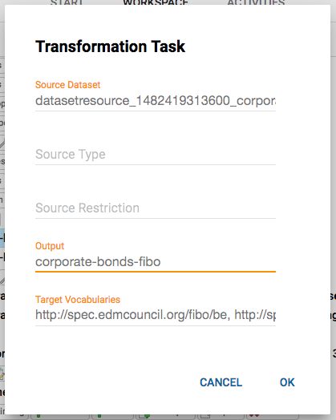

# Overview of the workspace

The workspace is the main entry point of Silk Workbench and provides a tree view of your work, structured in _projects_.

## Projects

The project is the main metaphor to structure your work. In the workspace, you can review your projects, create new or delete old ones, and import or export projects via an XML exchange format.

Each project is self-contained and holds all relevant parts, such as the following:

1. the raw _data resources_ (local or remote data files) that form the starting point for your work
2. the _data sets_ that provide uniform access to different kinds of data resources
3. _transformation tasks_ to transform data sets (e.g., from one format or schema to another)
4. _linking tasks_ to integrate different data sets
5. _workflows_ to orchestrate the different tasks
6. definitions of _URI prefixes_ used in the project

Resources, data sets, tasks and other parts of a project can be added and configured from within the workspace. By clicking the `Open` button on any part of a project, you can 'look inside' it and define the actual transformation or linking rules, or assemble the actual workflow.

## Data sets

A data set represents an abstraction over raw data.
In order to work with data in Silk Workbench, you have to make it available in the form of a data set.
A data set provides a source or destination for the different kinds of tasks.
I.e., it may be used to read entities for transformation or linking, and it can be used to write transformed entities and generated links.

Silk Workbench provides a range of different data set types for different kinds of source data. Some examples are:

* CSV
* RDF
* XML
* JSON
* SPARQL
* JDBC
* Hive
* Hadoop Sequence File
* etc.

The complete list of available data set types and their configuration parameters can be found in the Plugin Reference.

## Transform tasks

A transfom task generates new entities based on existing ones by transforming selected values.
In this way, you can transform datasets from one schema or format to another.
The output of a transform task can either be written directly to an output data set, or provide the input to another task if integrated into a workflow.

{ width=39% }

## Linking tasks

The purpose of linking tasks is to integrate two datasets (source and target) by generating a linkset that contains links from the source to the target dataset.

As in the case of transform tasks, the output linkset of a linking task can either be written directly to an output data set, or provide the input to another task if integrated into a workflow.

{ width=39% }

## Workflows

For projects that go beyond one or two simple transform or linking tasks, you can set up a complex workflow in Silk Workbench.
In a workflow, you can orchestrate datasets, transform and linking tasks in terms of inputs and outputs to each other, and in this way perform complex tasks.

## Workspace operations

### Copying tasks

You can copy a task to another project by dragging it onto the target project.
If a copied tasks references other tasks (directly or indirectly) all referenced tasks are copied as well.
For instance, if a transform task is copied that references a dataset, the dataset is copied as well.
Referenced data resources are copied only if the target project uses a different resource path than the source project.

If the target project already contains a task with the same identifier as a copied task, a dialog will ask for confirmation before execution the copy operation.
