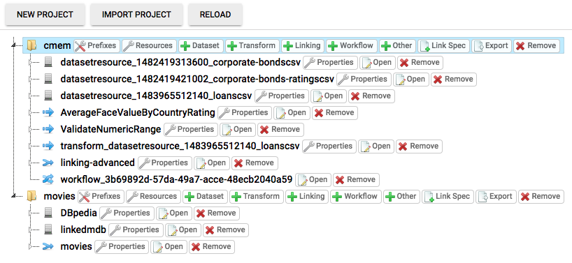

The Workspace allows users to manage data sources and linking tasks defined for each project.

The Workspace Browser shows a tree view of all Projects in the current Workspace:

# Projects

A project holds the following information:

1.  All URI prefixes which are used in the project.
2.  A list of data sources
3.  A list of linking tasks

Users are able to create new projects or import existing ones. Existing projects can be deleted or exported to a single file.

# Data Sets

A data set holds all information that is needed to retrieve entities from it as well as to store entities.
Users can add new data sets and edit their properties.

# Linking Tasks

Linking tasks consist of the following elements:

1.  Metadata
2.  A link specification
3.  Positive and negative reference links

Linking Tasks can be added to an existing project and removed from it. Clicking on <code>Metadata</code> opens a dialog to edit the meta data of a linking task:

The following properties can be edited:

-   **Name** The unique name of the linking task
-   **Source** The source data set
-   **Source restriction** Restricts source dataset using SPARQL clauses
-   **Target** The target data set
-   **Target restriction** Restricts target dataset using SPARQL clauses
-   **Output** The data sink for writing generated links to

Clicking on the <code>open</code> button opens the [Linkage Rule Editor](linking_editor.md).